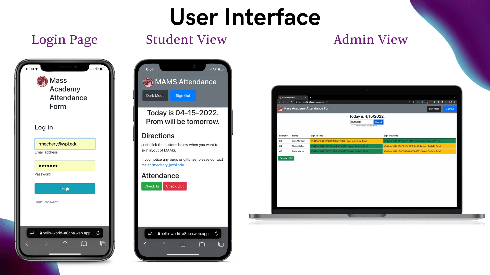

# Mass Academy Online Attendance Page
 This repository contains code I developed to convert the attendance system at Mass Academy to an all digital format. The front-end is a web application written in HTML, Javascript, and Bootstrap. Firebase was used as the backend with all data being stored on a remote Firestore server.

# Please Note
This tool was only designed for students and faculty of Mass Academy and as such user credentials for login will not be made public as of now.

# User Interface

# Presentation
View a summary of the presentation at  (clicking on the picture will take you to Canva).

